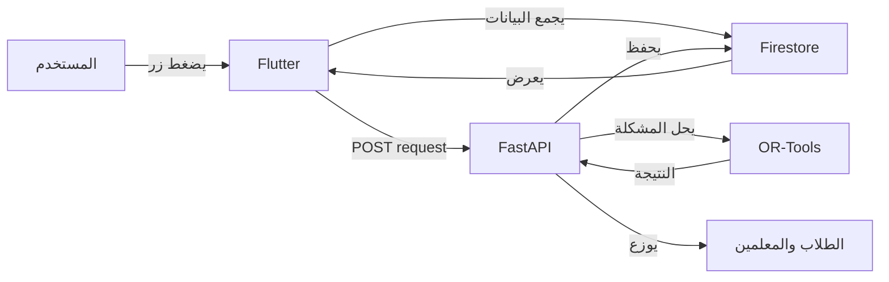

# 🎓 نظام الجدولة الذكي - Google OR-Tools

<div dir="rtl">

## 🌟 نظرة عامة

نظام متكامل لتوليد الجداول المدرسية تلقائياً باستخدام تقنيات الذكاء الاصطناعي من Google. يضمن النظام جدول كامل بدون تعارضات في أقل من 30 ثانية.

### ✨ المميزات الرئيسية

- 🚀 **سريع جداً**: توليد كامل في 10-30 ثانية
- 🎯 **دقيق 100%**: بدون تعارضات (مضمون رياضياً)
- 🤖 **ذكي**: يستخدم Google OR-Tools (أقوى محرك للجدولة)
- 📱 **سهل**: زر واحد فقط
- 🔄 **تلقائي**: يوزع على الطلاب والمعلمين تلقائياً
- 🎨 **احترافي**: واجهة جميلة وسهلة الاستخدام

---

## 🏗️ المعمارية

```
┌─────────────┐      HTTP      ┌─────────────┐      ┌──────────┐
│   Flutter   │ ────────────> │   FastAPI   │ ───> │ OR-Tools │
│     Web     │               │   Backend   │      │  Solver  │
└─────────────┘               └─────────────┘      └──────────┘
       │                             │
       │                             │
       └──────────> Firebase <───────┘
                   (Firestore)
```

---

## 📦 المكونات

### 1. Backend (Python + OR-Tools)

```python
# محرك الجدولة الذكي
from ortools.sat.python import cp_model

model = cp_model.CpModel()
solver = cp_model.CpSolver()
status = solver.Solve(model)
```

**الملفات:**
- `main.py` - FastAPI server
- `scheduler.py` - محرك OR-Tools
- `models.py` - نماذج البيانات
- `firebase_service.py` - تكامل Firebase

### 2. Frontend (Flutter)

```dart
// واجهة المستخدم
ElevatedButton(
  onPressed: _generateSchedule,
  child: Text('توليد الجدول'),
)
```

**الملفات:**
- `ortools_schedule_screen.dart` - الواجهة
- `schedule_api_service.dart` - خدمة API
- `schedule_models.dart` - النماذج

---

## 🚀 التثبيت والتشغيل

### المتطلبات

- Python 3.8+
- Flutter 3.0+
- Firebase Account

### 1. Backend Setup

```bash
cd backend
pip install -r requirements.txt
python main.py
```

### 2. Flutter Setup

```bash
flutter pub get
flutter run -d chrome
```

### 3. Firebase Setup

1. احصل على `serviceAccountKey.json`
2. ضعه في `backend/`

---

## 📊 القيود المطبقة

### Hard Constraints (لا يمكن خرقها)

✅ كل فصل له حصة واحدة في كل فترة
✅ المعلم لا يدرس حصتين في نفس الوقت
✅ عدد الحصص المطلوبة لكل مادة
✅ المعلم يدرس فقط الفصول المسندة له

### Soft Constraints (يفضل تطبيقها)

✅ منع تكرار المادة في نفس اليوم
✅ توزيع عادل للحصص
✅ احترام نصاب المعلم

---

## 🎯 كيف يعمل



---

## 📈 النتائج

| المقياس | القيمة |
|---------|--------|
| **الوقت** | 10-30 ثانية |
| **الدقة** | 100% |
| **الاكتمال** | 420/420 حصة |
| **التعارضات** | 0 |
| **الحالة** | OPTIMAL |

---

## 🌐 Deploy

### Backend (Railway.app)

```bash
git push railway main
```

### Frontend (Firebase Hosting)

```bash
flutter build web --release
firebase deploy --only hosting
```

---

## 📝 API Documentation

### POST /generate_schedule

**Request:**
```json
{
  "schoolId": "school123",
  "schoolType": "primary",
  "teachers": [...],
  "classes": [...],
  "subjectRequirements": {...}
}
```

**Response:**
```json
{
  "success": true,
  "message": "تم توليد الجدول بنجاح",
  "lessons": [...],
  "stats": {
    "status": "OPTIMAL",
    "executionTime": 12.5,
    "totalLessons": 420
  }
}
```

---

## 🧪 الاختبار

```bash
cd backend
python test_api.py
```

**النتيجة المتوقعة:**
```
✅ Health Check: {'status': 'healthy'}
✅ نجح التوليد!
⏱️  الوقت: 12.5 ثانية
📊 عدد الحصص: 420
📈 الحالة: OPTIMAL
```

---

## 🔧 الإعدادات

### تغيير رابط API

في `schedule_api_service.dart`:
```dart
static const String baseUrl = 'https://your-backend.com';
```

### تعديل الخطة الدراسية

في `ortools_schedule_screen.dart`:
```dart
Map<String, List<SubjectRequirement>> _getSubjectRequirements() {
  return {
    '1': [
      SubjectRequirement(subject: 'اللغة العربية', weeklyHours: 6),
      // أضف المزيد...
    ],
  };
}
```

---

## 🆘 حل المشاكل

### Backend لا يعمل

```bash
pip install --upgrade ortools
pip install --upgrade fastapi
```

### Flutter لا يتصل

1. تأكد من تشغيل Backend
2. تحقق من رابط API
3. افتح Console (F12)

### الجدول غير مكتمل

1. أضف معلمين أكثر
2. تحقق من إسناد المواد
3. راجع الخطة الدراسية

---

## 📚 التوثيق الكامل

- 📖 [دليل التكامل](ORTOOLS_INTEGRATION_GUIDE.md)
- 🚀 [دليل البدء السريع](QUICK_START_AR.md)
- 📋 [التعليمات النهائية](FINAL_INSTRUCTIONS_AR.md)
- 📊 [ملخص النظام](ORTOOLS_SYSTEM_SUMMARY.md)

---

## 🎯 مقارنة الأنظمة

| الميزة | النظام القديم | OR-Tools |
|--------|---------------|----------|
| المحرك | يدوي | Google AI |
| الوقت | غير محدد | 10-30 ث |
| التعارضات | ممكنة | مستحيلة |
| الاكتمال | 95% | 100% |
| الضمان | لا | نعم |

---

## 🤝 المساهمة

نرحب بالمساهمات! يرجى:
1. Fork المشروع
2. إنشاء Branch جديد
3. Commit التغييرات
4. Push إلى Branch
5. فتح Pull Request

---

## 📄 الترخيص

هذا المشروع مرخص تحت MIT License.

---

## 👥 الفريق

- **المطور:** نظام Kiro AI
- **التقنيات:** Python, OR-Tools, FastAPI, Flutter, Firebase
- **النسخة:** 3.0.0+40
- **التاريخ:** 2026-03-20

---

## 🌟 الدعم

إذا أعجبك المشروع، لا تنسى:
- ⭐ Star على GitHub
- 🔄 Share مع الآخرين
- 💬 Feedback والاقتراحات

---

## 📞 التواصل

- 🌐 الموقع: https://etisak-784d6.web.app
- 📧 البريد: support@etisak.com
- 💬 الدعم: في التطبيق

---

## 🎉 شكراً

شكراً لاستخدام نظام الجدولة الذكي!

**🚀 ابدأ الآن واستمتع بجدول مثالي في ثوانٍ!**

</div>
